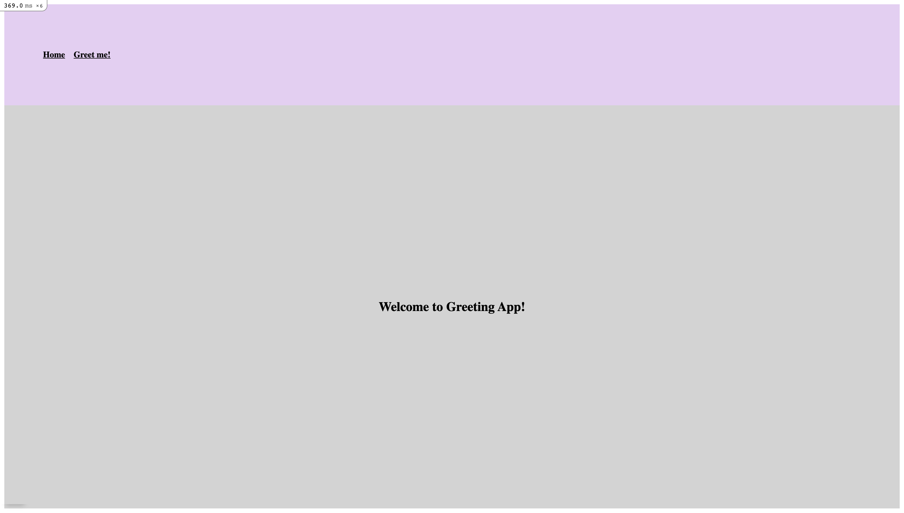
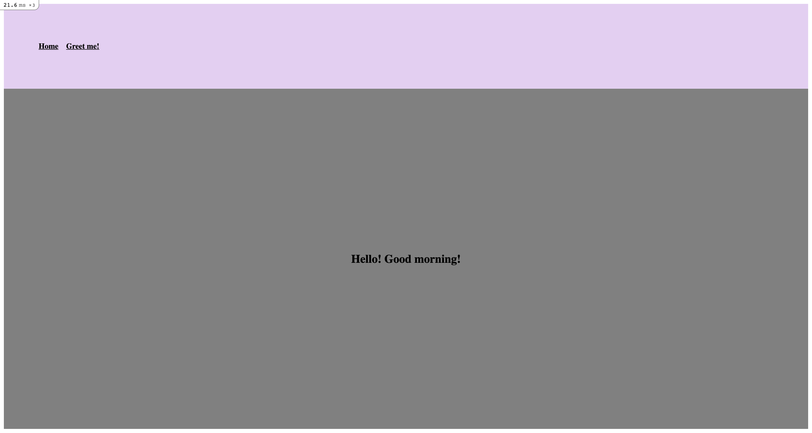

# Hello Rails React!

## About

The main goals for this exercise are:

- Implement a connection between a Ruby on Rails back-end and React front-end.
- Understand the pros and cons of different approaches of connecting Ruby on Rails back-end with React front-end.

Below, we can see a screenshot of the app.

<p align="center">


</p>

## Built With

- Ruby on Rails
- ReactJS, Redux
- VisualStudio Code, Git, & GitHub

## Pre-requisites

- Ruby (v. 3.0.1)
- Rails (v. 6.1.4)
- NodeJs (v. 14.17)
- YarnJs (v. 1.22.10)
- Git

## Getting Started

1. In your terminal, in the folder of your preference, type the following bash command to clone this repository:

```sh
git clone git@github.com:fortuneonyeka/hello-rails-react.git
```

2. Now that you have already cloned the repo run the following commands to get the project up and running:

```sh
cd hello-rails-react
bundle
yarn
bin/rails db:create
bin/rails db:migrate
bin/rails db:seed
```

3. Now, on your terminal, run:

```sh
bin/rails server
```

This should start your local server in [http://localhost:3000/](http://localhost:3000/). Now, you can go to your browser and visit this page, and you also can open the rest API client of your choice (Thunder Client extension for VScode is recommended) to fetch a randomly selected greeting message:

| Request                            | Endpoint         | Method | Header                                                               |
| ---------------------------------- | ---------------- | ------ | -------------------------------------------------------------------- |
| Randomly selected greeting message | `/api/greetings` | GET    | { "Accept": "application/json", "Content-Type": "application/json" } |

To stop the server, hit `<CTRL> + C` on your keyboard.

## Author

👤 **Ihedoro Fortunatus O**

- GitHub: [@fortuneonyeka](https://github.com/fortuneonyeka)
- Twitter: [@onyekafortune](https://twitter.com/onyekafortune)
- LinkedIn: [Ihedoro Fortunatus](https://www.linkedin.com/in/fortunatus-ihedoro/)

## 🤝 Contributing

Contributions, issues, and feature requests are welcome!

## Show your support

Give a ⭐️ if you like this project!

## 📝 License

This project is [MIT](./LICENSE) licensed.
